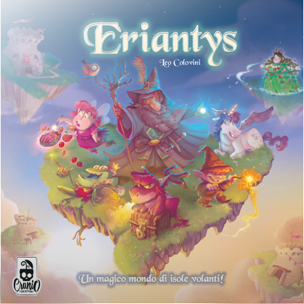

# Software Engineering Project 2022



**Students**
- Leonardo Favento ([@leofavento](https://github.com/leofavento))
- Matteo Laini ([@matteolaini](https://github.com/matteolaini))
- Matteo Macaluso ([@magicteo](https://github.com/magicteo))

## Implemented functionalities

| Functionality      |          State          |
|:-------------------|:-----------------------:|
| Basic rules        |    :heavy_check_mark:   |
| Complete rules     |    :heavy_check_mark:   |
| CLI                |    :heavy_check_mark:   |
| Socket             |    :heavy_check_mark:   |
| GUI                | :heavy_multiplication_x: |
| 12 Character Cards |   :heavy_check_mark:    |
| 4 Players mode     | :heavy_check_mark: |
| Multiple games     | :heavy_check_mark: |

## Build

After having installed Java JRE (minimum version 14) and Maven, clone this repo.
Inside the cloned repo, run:
```bash
mvn clean package
```
You will find the executable jar files `EriantysClient.jar` and `EriantysServer.jar` inside the `target` folder.

## Running

In the [deliveries](deliveries) folder there are the two executable jar files already compiled.
- In order to run the server, execute this command:
    ```bash
    java -jar EriantysServer.jar
    ```
    You will be asked to specify your desired port or to keep the default one (25565).

- To run the client, execute this command:
    ```bash
    java -jar EriantysClient.jar
    ```
  You will be able to choose between the CLI or the GUI interface by typing the option number on your keyboard accordingly.